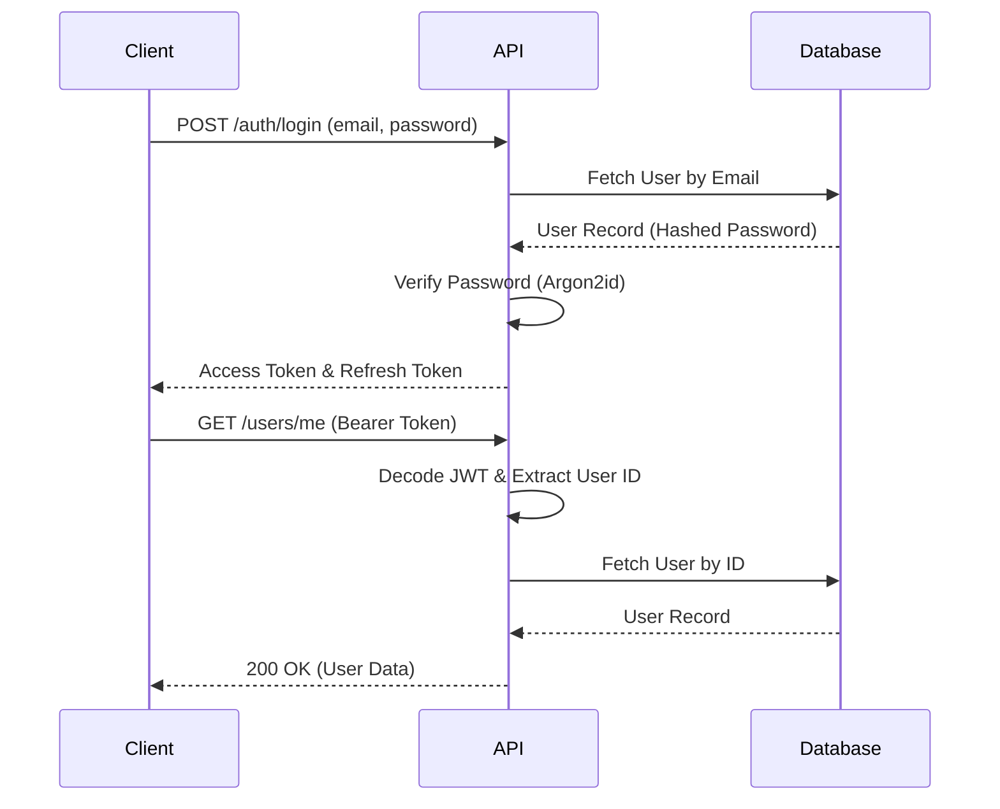

# Authentication Flow

TransitOps uses a stateless JSON Web Token (JWT) architecture combined with secure Argon2id password hashing.

## Step-by-Step Flow

### 1. Login
- **Client** sends `POST /api/v1/auth/login` with `username` (email) and `password`.
- **Router** passes credentials to `AuthService`.
- **Service** retrieves the user via `UserRepository`.

### 2. Password Verification
- **Service** uses `pwdlib` to verify the provided password against the Argon2id `hashed_password` stored in the database.
- If invalid, a `401 Unauthorized` exception is raised.

### 3. JWT Generation
- If valid, the system generates two tokens:
  - **Access Token:** Valid for 8 days. Used for API authorization. Payload includes `sub` (User ID) and `type: access`.
  - **Refresh Token:** Valid for 30 days. Used to obtain new access tokens. Payload includes `sub` (User ID) and `type: refresh`.

### 4. Authenticated Request
- **Client** attaches the Access Token in the `Authorization` header as `Bearer <token>`.
- The `get_current_user` dependency intercepts the request, decodes the JWT, extracts the User ID, and fetches the user from the DB.

### 5. Permission Validation (RBAC)
- If the endpoint uses the `require_permission("...")` dependency, the system checks the `RolePermissions` table to ensure the user's assigned role contains the requested permission.

### 6. Refresh Token
- When the Access Token expires, the **Client** sends `POST /api/v1/auth/refresh` with the Refresh Token.
- The system validates the token and issues a new Access/Refresh token pair.

## Sequence Diagram

