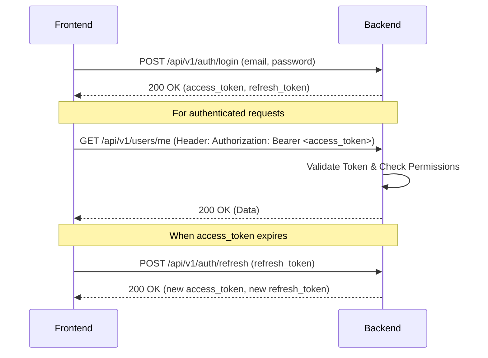

# TransitOps API Contract

This document serves as the single source of truth and canonical reference for frontend integration with the TransitOps backend. It outlines the API architecture, available endpoints, authentication mechanisms, and response formats.

---

## 1. Overview

- **Base URL:** `/api/v1`
- **API Version:** `v1`
- **Response Format:** Standardized JSON Envelope (Success/Error wrappers)
- **Error Format:** Standardized JSON Envelope with `errors` array
- **Authentication Strategy:** Stateless JWT (JSON Web Token) Access & Refresh Tokens
- **Pagination Strategy:** Standardized Query Parameters (`page`, `limit`) and Response Metadata
- **Sorting Strategy:** Query Parameters (`sort_by`, `sort_desc`)
- **Filtering Strategy:** Query Parameter (`search`)
- **Naming Conventions:** `snake_case` for all API payloads and responses. (Frontend is responsible for mapping to `camelCase` if desired).

---

## 2. Authentication

TransitOps uses a JWT-based authentication flow.

### JWT Authentication Flow



### Endpoints

#### `POST /api/v1/auth/login`
- **Purpose:** Authenticate user and receive tokens.
- **Headers:** `Content-Type: application/x-www-form-urlencoded`
- **Body:** `username` (string, email), `password` (string)
- **Validation:** Username must be valid email format.
- **Success Response (200):**
  ```json
  {
    "access_token": "eyJhbGci...",
    "refresh_token": "eyJhbGci...",
    "token_type": "bearer"
  }
  ```
- **Error Responses:** `401 Unauthorized` (Incorrect email or password)
- **Permission Required:** None

#### `POST /api/v1/auth/refresh`
- **Purpose:** Refresh an expired access token using a valid refresh token.
- **Headers:** `Content-Type: application/json`
- **Body:**
  ```json
  {
    "refresh_token": "string"
  }
  ```
- **Success Response (200):** Returns new `access_token` and `refresh_token`.
- **Error Responses:** `401 Unauthorized` (Invalid or expired refresh token)
- **Permission Required:** None

#### `POST /api/v1/auth/logout`
- **Purpose:** Log out the user. The backend logout is stateless; the frontend must discard tokens.
- **Headers:** None required.
- **Body:** None
- **Success Response (200):** Standard success wrapper.
- **Permission Required:** None

#### `GET /api/v1/users/me`
- **Purpose:** Retrieve the profile of the currently logged-in user.
- **Headers:** `Authorization: Bearer <access_token>`
- **Body:** None
- **Success Response (200):**
  ```json
  {
    "success": true,
    "message": "Current user retrieved successfully",
    "data": {
      "id": "uuid",
      "email": "user@example.com",
      "first_name": "First",
      "last_name": "Last",
      "is_active": true,
      "is_superuser": false,
      "role_id": "uuid"
    }
  }
  ```
- **Error Responses:** `401 Unauthorized`
- **Permission Required:** Must be authenticated.

---

## 3. Global Response Format

Every API endpoint (except OAuth2 `/login`) returns a standardized response envelope.

### Success
```json
{
    "success": true,
    "message": "Human readable success message",
    "data": {} // The actual payload (object, array, or null)
}
```

### Error
```json
{
    "success": false,
    "message": "Human readable error description",
    "errors": [] // Array of detailed error objects/strings (e.g., validation errors)
}
```

---

## 4. Authentication Header

To authenticate a request, include the `access_token` in the `Authorization` header.

**Format:**
```http
Authorization: Bearer <ACCESS_TOKEN>
```

**Axios Example:**
```javascript
axios.get('/api/v1/users/me', {
  headers: {
    'Authorization': `Bearer ${accessToken}`
  }
});
```

---

## 5. Pagination Standard

All endpoints returning collections implement standardized pagination.

**Request Query Parameters:**
- `page` (int): Page number (default: 1)
- `limit` (int): Items per page (default: 50)
- `search` (string): Text search across relevant fields
- `sort_by` (string): Field to sort by
- `sort_desc` (boolean): Sort descending if true

**Response Payload (`data` object):**
```json
{
    "success": true,
    "message": "Data retrieved successfully",
    "data": {
        "items": [
            { "id": 1, "name": "Item 1" }
        ],
        "total": 100,
        "page": 1,
        "limit": 50,
        "total_pages": 2
    }
}
```

---

## 6. Error Codes

- **`400 Bad Request`**: Malformed request syntax or business validation failure. Check `errors` array.
- **`401 Unauthorized`**: Authentication is required and has failed or has not yet been provided (missing/expired token, wrong password).
- **`403 Forbidden`**: The user is authenticated but does not possess the required RBAC permissions for the resource.
- **`404 Not Found`**: The requested resource could not be found.
- **`409 Conflict`**: The request conflicts with the current state of the server (e.g., duplicate email during registration).
- **`422 Unprocessable Entity`**: Pydantic schema validation failure (missing fields, wrong types). Check `errors` array.
- **`500 Internal Server Error`**: Unexpected backend failure.

---

## 7. Permissions

The following permissions are currently seeded in the database. Superusers (`is_superuser=True`) implicitly have all permissions.

| Permission | Description | Assigned Roles |
| :--- | :--- | :--- |
| `vehicle.create` | Create vehicles | Admin, Fleet Manager |
| `vehicle.read` | Read vehicles | Admin, Fleet Manager, Driver, Safety Officer, Financial Analyst |
| `vehicle.update` | Update vehicles | Admin, Fleet Manager |
| `vehicle.delete` | Delete vehicles | Admin, Fleet Manager |
| `driver.create` | Create drivers | Admin, Fleet Manager, Safety Officer |
| `driver.read` | Read drivers | Admin, Fleet Manager, Driver, Safety Officer, Financial Analyst |
| `driver.update` | Update drivers | Admin, Fleet Manager, Safety Officer |
| `driver.delete` | Delete drivers | Admin, Fleet Manager, Safety Officer |
| `trip.create` | Create trips | Admin, Fleet Manager, Driver |
| `trip.read` | Read trips | Admin, Fleet Manager, Driver, Safety Officer, Financial Analyst |
| `trip.dispatch` | Assign/dispatch trips | Admin, Fleet Manager, Driver |
| `trip.complete` | Complete trips | Admin, Driver |
| `trip.cancel` | Cancel trips | Admin, Fleet Manager, Driver |
| `maintenance.create`| Schedule maintenance | Admin, Fleet Manager |
| `maintenance.read` | Read maintenance | Admin, Fleet Manager, Driver, Safety Officer, Financial Analyst |
| `maintenance.update`| Update maintenance | Admin, Fleet Manager |
| `fuel.create` | Log / manage fuel | Admin, Fleet Manager, Driver |
| `fuel.read` | Read fuel logs | Admin, Fleet Manager, Driver, Safety Officer, Financial Analyst |
| `expense.create` | Log expenses (fuel/tolls/misc) | Admin, Fleet Manager, Driver |
| `expense.read` | Read expenses | Admin, Fleet Manager, Driver, Safety Officer, Financial Analyst |
| `dashboard.view` | View dashboard | All Roles |
| `notification.read`| Read notifications | All Roles |
| `settings.manage` | Manage settings | Admin |

*(Note: Exact role mappings can be dynamically changed in the DB. The above reflects the baseline seed).*

---

## 8. API Index

| Method | URL | Module | Auth Required | Permission Required | Status |
| :--- | :--- | :--- | :--- | :--- | :--- |
| POST | `/api/v1/auth/login` | Auth | No | None | ✅ |
| POST | `/api/v1/auth/refresh` | Auth | No | None | ✅ |
| POST | `/api/v1/auth/logout` | Auth | No | None | ✅ |
| GET | `/api/v1/users/me` | Users | Yes | None | ✅ |

*(Table will be updated as new endpoints are implemented).*

---

## 9. Module Documentation

### IAM (Auth & Users)
- **Purpose:** Handle user authentication, session management, and current user profile retrieval.
- **Business Rules:** Passwords must be hashed using Argon2id. Tokens expire (8 days access, 30 days refresh).
- **Endpoints:** Documented in [Section 2](#2-authentication).

### Fleet
*(Pending Implementation)*

### Drivers
*(Pending Implementation)*

### Trips
*(Pending Implementation)*

### Maintenance
*(Pending Implementation)*

### Finance
*(Pending Implementation)*

### Dashboard
*(Pending Implementation)*

### Notifications
*(Pending Implementation)*

### Settings
*(Pending Implementation)*

---

## 10. Frontend Integration Notes

- **Token Storage:** Store `access_token` in memory or secure storage. Store `refresh_token` in HTTP-only cookies if possible, or secure storage. Do not rely heavily on localStorage for highly sensitive sessions if XSS is a concern.
- **Refresh Flow:** Implement an Axios response interceptor. If a request returns `401`, automatically pause pending requests, call `/api/v1/auth/refresh` with the refresh token, update the stored access token, and retry the failed requests. If the refresh fails, force a logout.
- **Logout:** Calling `/auth/logout` is optional for the backend (as JWTs are stateless), but crucial for UI state. Always clear local tokens.
- **Optimistic Updates:** The standardized response `data` payload returns the fully hydrated entity after a mutation. Use this returned object to update your local UI state (e.g., React Query / SWR cache) to avoid subsequent GET requests.
- **Pagination & Tables:** Pass `?page=1&limit=20` to list endpoints. Bind the resulting `total_pages` and `total` to your table's pagination controls.
- **Error Handling:** Always read the `message` field from `4xx` responses to display generic toast notifications. For forms, read the `errors` array from `422` responses to highlight specific input fields.

---

## 11. Changelog

### v0.2.0 - IAM Module
**Added**
- `POST /api/v1/auth/login`
- `POST /api/v1/auth/refresh`
- `POST /api/v1/auth/logout`
- `GET /api/v1/users/me`
- RBAC permissions seeded to DB.
- Stateless JWT & Argon2id.

### v0.1.0 - Backend Foundation
**Added**
- Initial Architecture Scaffolding.
- BaseRepository & BaseService.
- Standardized Pagination and API Responses.
- SQLAlchemy 2.0 with UUIDv7.
